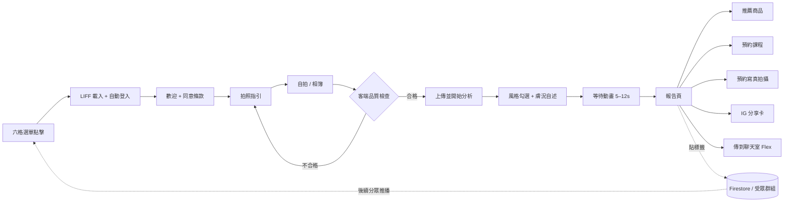

# 01 · 產品需求文檔（PRD）與使用者體驗動線

> 專案代號：**BeautyLens**（暫定）
> 版本：v0.1（MVP 範圍）｜負責人：Han｜更新：2026-09-15

---

## 1. 背景與問題

| 面向 | 現況 | 痛點 |
|---|---|---|
| 照相館 | 客人來拍韓式證件照 / 形象照，等待與化妝時段有空檔 | 沒有把「拍照客」轉成「美妝客」的觸點 |
| 美妝諮詢 | 一對一諮詢需人力，無法規模化 | 客人不知道自己適合什麼，缺乏開口的理由 |
| 保養品電商 | 官網流量仰賴社群投放 | 缺少「個人化理由」驅動的導購 |
| LINE OA | 好友數在成長，但互動率低、無分眾 | 群發成本高、不精準（台灣 LINE OA 以則計價） |

**核心假設**：一個 90 秒內完成、結果「像在說我」的 AI 診斷，能把 LINE 好友轉成有標籤的潛在客戶，並提供自然的導購理由。

## 2. 目標與 KPI

### 2.1 商業目標
1. 把 LINE 好友 / 來店客轉為「有標籤、可分眾」的名單。
2. 提高保養品官網與彩妝課程的轉換率。
3. 透過 IG 限動分享卡取得自然流量與新好友。

### 2.2 北極星指標
**每週完成診斷並點擊至少一個導流按鈕的人數。**

### 2.3 KPI（MVP 上線後 8 週）

| 指標 | 目標 | 量測方式 |
|---|---|---|
| 六格選單點擊 → LIFF 開啟率 | ≥ 60% | LINE OA 洞察 + 前端 `liff_ready` 事件 |
| LIFF 開啟 → 完成上傳 | ≥ 50% | Firestore `events` |
| 完成上傳 → 看到報告（AI 成功率） | ≥ 95% | 後端 log |
| 報告 → 任一導流按鈕 CTR | ≥ 25% | `events.cta_click` |
| 報告 → 分享卡產生 | ≥ 15% | `events.share_card` |
| 分享卡 → 新好友（追蹤連結） | 每 100 張 ≥ 5 位 | LINE OA 好友來源（帶 `?ref=` 的加好友連結） |
| 單次診斷雲端成本 | ≤ NT$2 | Anthropic usage + Vercel/Firebase 帳單 |
| P95 分析等待時間 | ≤ 15 秒 | 後端 timing |

## 3. 目標使用者（Personas）

| 人物誌 | 情境 | 動機 | 顧慮 |
|---|---|---|---|
| **小恩，24 歲，來拍證件照** | 等待叫號時看到店內立牌 QR / 店員推薦 | 好奇、想知道自己是什麼臉型與色彩型 | 不想花太久、擔心照片被留存 |
| **Vivian，31 歲，LINE 老好友** | 在家看到 LINE 推播 | 想換妝感、想知道該買什麼 | 怕被硬推銷 |
| **店員 / Han 本人** | 諮詢時輔助 | 用報告當開場、快速掌握客人特徵 | 報告要看起來專業、可信 |

## 4. 範圍

### 4.1 MVP 內（In Scope）
- LIFF 內完成：同意 → 拍照/上傳 → 品質檢查 → 風格勾選 → AI 分析 → 報告 → 導流 / 分享。
- 6 種臉型、淡顏/濃顏與比例特性、春夏秋冬四季型（含 12 細分僅作為「傾向」提示）、膚質初判（油/乾/混合/敏感傾向、與光澤/毛孔/暗沉的觀察）。
- 腮紅 / 修容 / 打亮位置圖解（預製圖庫）。
- 服裝顏色「適合 / 避雷」色票（依季型）。
- 自動貼標籤寫入 Firestore，並同步為 LINE 受眾群組（供分眾推播）。
- 三個導流：推薦保養/彩妝商品（依膚質與色彩型）、彩妝課預約（LINE 預約或表單）、IG 限動分享卡（PNG）。
- 報告以 Flex Message 送回 LINE 聊天室（由使用者端 `liff.sendMessages` 送出，不消耗 OA 訊息額度）。

### 4.2 MVP 外（Out of Scope，Phase 2+）
- 把圖解疊在客人自己的照片上（見 03 文件的方案 C）。
- 髮型 / 眉型建議、AI 虛擬試妝（試色）。
- 多語系、桌機版。
- 與電商後台的即時庫存 / 價格串接（MVP 用靜態商品清單）。
- 客人歷史紀錄比較（「上次 vs 這次」）。

## 5. 功能需求（Functional Requirements）

編號規則：`FR-<模組>-<序號>`。優先級 P0 = MVP 必要，P1 = MVP 想要，P2 = Phase 2。

### 5.0 入口帳號（Han 決策 2026-09-15）
- LIFF 掛在 **Han 個人官方帳號「于涵 Han｜質感保養與…」**（尚未認證的 OA）之下；IG 個人檔案已放此帳號連結。
- 韓式照相館「莎朗嘿yo」目前**沒有**特別曝光這個帳號，因此店內立牌 QR 與梳化台立牌是照相館客人進入的主要橋梁（`?ref=store`）。
- 若照相館日後有自己的 OA，其選單也可直接連同一個 LIFF 網址；LIFF 的 Bot link 設定會讓使用者順便加 Han 的帳號。
- 此帳號目前顯示「尚未經過認證」警語。建議申請 LINE 認證帳號（藍盾），可移除警語、提升掃碼信任度，且可在 LINE 內被搜尋到。

### 5.1 入口與登入（ENTRY）
| 編號 | 需求 | 優先 |
|---|---|---|
| FR-ENTRY-1 | 六格選單（Rich Menu 2500×1686，六格版型）其中一格為 LIFF URL 動作，開啟 `https://liff.line.me/{LIFF_ID}` | P0 |
| FR-ENTRY-2 | LIFF 以 `Full` 尺寸開啟，`liff.init` 後若未登入則 `liff.login()`；取得 `userId`、`displayName`、`pictureUrl` | P0 |
| FR-ENTRY-3 | 若在外部瀏覽器開啟（非 LINE 內），顯示「請從 LINE 開啟」並提供加好友連結 | P0 |
| FR-ENTRY-4 | 首屏 3 秒內可互動（Vite code-split，`/beauty` 路由獨立 chunk） | P1 |
| FR-ENTRY-5 | 支援 `?ref=` 來源參數（店內 QR、IG、推播），寫入事件 | P1 |

### 5.2 同意與個資（CONSENT）
| 編號 | 需求 | 優先 |
|---|---|---|
| FR-CONSENT-1 | 上傳前需勾選同意：照片僅用於本次分析、分析後 24 小時內刪除原圖、僅保留文字結果與標籤 | P0 |
| FR-CONSENT-2 | 提供隱私權說明頁連結（依台灣個資法第 8 條告知事項） | P0 |
| FR-CONSENT-3 | 使用者可在報告頁「刪除我的資料」（刪除分析紀錄與標籤） | P1 |

### 5.3 拍照與上傳（CAPTURE）
| 編號 | 需求 | 優先 |
|---|---|---|
| FR-CAP-1 | 「自拍」使用 `<input type="file" accept="image/*" capture="user">`；「相簿」使用同元素不帶 `capture` | P0 |
| FR-CAP-2 | 拍照前顯示指引卡：正臉、自然光或面光、不戴帽/眼鏡、素顏或淡妝、頭髮撥開露出額頭與下顎線、距離約一臂長 | P0 |
| FR-CAP-3 | 客端預處理：EXIF 方向修正、長邊縮至 1024px、JPEG 品質 0.82、輸出 ≤ 300KB | P0 |
| FR-CAP-4 | 客端品質檢查：亮度（平均灰階 60–200）、模糊（Laplacian 變異數門檻）、偵測到恰好一張臉且臉框佔畫面 ≥ 25%（MediaPipe Face Detection，wasm，離線） | P0 |
| FR-CAP-5 | 品質不合格時給具體原因與重拍按鈕（「太暗了，請面向窗戶」「臉太小，請靠近一點」） | P0 |
| FR-CAP-6 | 顯示縮圖預覽與「使用這張 / 重拍」 | P0 |
| FR-CAP-7 | 每位使用者每日最多 3 次分析（防濫用與控制成本），超過顯示提示 | P0 |

### 5.4 風格選填（STYLE）
| 編號 | 需求 | 優先 |
|---|---|---|
| FR-STYLE-1 | 多選標籤（最多 3 個）：韓系清透裸妝、俐落知性、甜酷、日系柔霧、歐美立體、法式慵懶、韓劇女主、職場通勤、約會、證件照/形象照 | P0 |
| FR-STYLE-2 | 可選情境：日常 / 上班 / 約會 / 拍照 / 婚禮賓客 | P1 |
| FR-STYLE-3 | 可選膚況自述：出油、乾燥、泛紅、痘痘（作為 AI 膚質判斷的輔助輸入） | P1 |
| FR-STYLE-4 | 風格頁在 AI 分析「進行中」同時顯示，縮短感知等待（照片上傳後立即開始分析，風格在第二次請求補上，或先送風格再送照片） | P1 |

### 5.5 AI 分析（AI）
| 編號 | 需求 | 優先 |
|---|---|---|
| FR-AI-1 | 後端接收 base64 影像 + 風格標籤 + 自述，呼叫視覺模型，回傳符合 `analysis-schema.json` 的 JSON | P0 |
| FR-AI-2 | 臉型：`round / square / oval / diamond / heart / oblong` 六選一，附信心度與 1–2 個依據（例：「下顎線圓潤、臉長寬比約 1.1」） | P0 |
| FR-AI-3 | 五官量感：`light / medium / bold`（淡顏 / 中間 / 濃顏），並回傳比例特性：眼距（寬/標準/窄）、中庭長度、下庭長度、顴骨突出、眉眼距離 | P0 |
| FR-AI-4 | 個人色彩：`spring / summer / autumn / winter`，附 `warm/cool`、`light/deep`、`clear/muted` 三軸判斷與信心度；信心度 < 0.6 時報告改用「傾向」措辭 | P0 |
| FR-AI-5 | 膚質初判：`oily / dry / combination / normal` + 觀察標記（`redness`, `pores`, `dullness`, `shine`, `dark_circles`），並註明「照片初判，非醫療診斷」 | P0 |
| FR-AI-6 | 妝容建議：依臉型輸出腮紅 / 修容 / 打亮的「位置代碼」（對應圖庫）與 1 句畫法說明；依季型輸出腮紅、唇色、眼影的色系建議 | P0 |
| FR-AI-7 | 服裝顏色：適合 6 色、避雷 4 色（HEX + 中文名） | P0 |
| FR-AI-8 | 一段 60–90 字的「風格總結」，語氣溫暖、具體、不批評外貌 | P0 |
| FR-AI-9 | 影像不符合要求（無臉、多臉、側臉、遮擋）時回傳 `quality.ok=false` 與原因，前端引導重拍，不計入每日次數 | P0 |
| FR-AI-10 | AI 呼叫失敗（逾時 / 429 / refusal）自動重試 1 次，仍失敗顯示友善錯誤並保留照片供重試 | P0 |
| FR-AI-11 | 原始照片不落地儲存；僅存分析 JSON（P0）。若未來要做「上次 vs 這次」再另行取得同意存圖（P2） | P0 |

### 5.6 報告輸出（REPORT）
| 編號 | 需求 | 優先 |
|---|---|---|
| FR-REP-1 | 報告頁區塊順序：① 總結卡 ② 臉型與量感 ③ 個人色彩 ④ 妝容圖解（腮紅 / 修容 / 打亮三層可切換） ⑤ 服裝色票 ⑥ 膚質與保養重點 ⑦ 導流按鈕 | P0 |
| FR-REP-2 | 圖解以 SVG 圖層渲染（見 03 文件），可單獨開關每一層，並有「為什麼這樣畫」的文字 | P0 |
| FR-REP-3 | 報告可「傳到聊天室」：以 `liff.sendMessages` 送出 Flex Message（總結 + 臉型 + 季型 + 三個按鈕），使用者日後可在聊天室找回 | P0 |
| FR-REP-4 | 報告連結可重開（`/beauty/report/{analysisId}`，需本人登入） | P1 |
| FR-REP-5 | 報告頁底部「這份分析準嗎？」👍👎 回饋，寫入事件供調整提示詞 | P1 |

### 5.7 導流（CTA）
| 編號 | 需求 | 優先 |
|---|---|---|
| FR-CTA-1 | 「為你挑的保養 / 彩妝」：依膚質與季型從商品對照表（品項來自玫琳凱型錄、規則由 Han 定義）挑 **4 件：2 件保養 + 2 件彩妝**（Han 決策：各半）；主按鈕「我想了解這 4 件」以 oaMessage 開 Han 的 LINE 對話框並預填商品名 + 精簡報告；若該商品有客人可開的網址則另顯示「看商品」 | P0 |
| FR-CTA-2 | 「我想預約彩妝課」：以 LINE 的 `oaMessage` 網址開啟 Han 官方 LINE 對話框，並**自動預填一段「分析報告精簡版」文字**（臉型、量感、季型、膚質、勾選風格、報告編號），使用者按送出即完成預約詢問；Han 端在聊天室直接看到重點 | P0 |
| FR-CTA-3 | 「IG 限動分享卡」：客端 Canvas 生成 1080×1920 PNG（臉型、季型、風格標籤、店家 LINE QR 與 `?ref=ig`），提供「儲存圖片」與「傳到聊天室」 | P0 |
| FR-CTA-4 | 分享卡預設不含客人照片，可選擇加入（再次確認） | P1 |
| FR-CTA-5 | 所有 CTA 點擊寫入 `events`（含 `analysisId`、`ctaType`） | P0 |
| FR-CTA-6 | 「我想預約拍照」（Han 決策新增）：以 oaMessage 開 Han 的 LINE 對話框，預填拍攝類型選項與精簡報告（含適合色），標籤追加 `intent:photo` | P0 |

### 5.8 標籤與分眾（TAG）
| 編號 | 需求 | 優先 |
|---|---|---|
| FR-TAG-1 | 分析完成後在 Firestore `users/{lineUserId}.tags` 寫入：`face:oval`、`season:summer`、`volume:light`、`skin:combination`、`style:korean_bare`、`stage:analyzed` | P0 |
| FR-TAG-2 | 點擊 CTA 後追加 `intent:product` / `intent:class` / `intent:photo` / `intent:share` | P0 |
| FR-TAG-3 | 每日排程把新增使用者同步進 LINE 受眾群組（Messaging API audience group，依季型 / 膚質建群），供 OA 後台分眾推播 | P1 |
| FR-TAG-4 | 後台（可先用 Firestore console 或既有店員 APP 頁面）可查詢：某標籤的人數、最近 7 天分析數 | P1 |
| FR-TAG-5 | 分析完成 48 小時後，若未點任何 CTA，推播一則「你的專屬色彩清單」（含商品）——用 Messaging API push，計入 OA 訊息額度，需開關控制 | P2 |

## 6. 非功能需求

| 類別 | 需求 |
|---|---|
| 效能 | LIFF 首屏 ≤ 3s（4G）；AI 分析 P95 ≤ 15s；圖解切換無感知延遲（本地 SVG） |
| 可用性 | 全流程可單手操作；字級 ≥ 14px；支援 iOS LINE 與 Android LINE 最近 2 個大版本 |
| 穩定性 | AI 供應商故障時顯示「稍後再試」並保留照片；每日次數限制；後端 idempotency key 防重送 |
| 安全 | 後端驗證 LIFF ID Token（`https://api.line.me/oauth2/v2.1/verify`）；API 只接受來自 LIFF 網域的請求；金鑰只存 Vercel 環境變數 |
| 個資 | 原圖不落地；分析結果與標籤保存至使用者要求刪除或 24 個月；隱私權政策明示 AI 供應商為境外處理 |
| 可觀測 | 每次分析記錄 token 用量、耗時、模型版本、prompt 版本；錯誤送 Vercel logs |
| 成本 | 單次 ≤ NT$2；LINE 訊息不因報告發送而增加額度消耗 |

## 7. 使用者體驗動線（User Journey Map）

### 7.1 流程圖

### 7.2 旅程表

| 階段 | 使用者動作 | 觸點 / 畫面 | 使用者想法與情緒 | 痛點 / 風險 | 設計對策 | 量測事件 |
|---|---|---|---|---|---|---|
| **0 觸發** | 在店內等待、或收到 LINE 推播、或看到朋友 IG 限動 | 店內立牌 QR、六格選單、IG 分享卡 | 「這是什麼？可以免費玩？」🙂 | 不知道要花多久 | 六格選單文案「90 秒 AI 妝容診斷」；立牌寫「等候時可玩」 | `entry` (+ `ref`) |
| **1 進入** | 點擊六格選單 | LIFF Full 開啟、自動登入 | 「載入中…」😐 | 首屏慢會流失 | 骨架屏、獨立 chunk、logo 動畫 | `liff_ready` |
| **2 同意** | 讀 2 行說明，勾選同意 | 歡迎頁：範例報告縮圖 + 「照片不保存」承諾 | 「照片會被存嗎？」🤔 | 個資疑慮 | 明確寫「分析完即刪除原圖」；隱私連結 | `consent_ok` |
| **3 指引** | 看拍照指引 | 插圖卡：正臉 / 面光 / 撥髮 | 「好，我懂了」🙂 | 指引太長沒人看 | 3 張圖示 + 1 句話，可跳過 | `guide_view` |
| **4 拍照** | 自拍或選相簿 | 原生相機 | 「這張可以嗎？」😬 | iOS 內嵌瀏覽器相機權限、照片太暗 | 用 `input capture`；預覽 + 即時品質檢查 + 明確重拍理由 | `photo_selected`, `quality_fail:{reason}` |
| **5 風格** | 勾 1–3 個風格、選膚況 | 標籤 chips（含示意圖） | 「我想要韓系那種」😊 | 名詞不懂 | 每個標籤附一張參考小圖 | `style_selected` |
| **6 等待** | 看進度動畫 | 「正在分析臉型…色彩…」分步文案 | 「快好了嗎？」😶 | 超過 10 秒焦慮 | 分步進度 + 品牌小知識輪播；風格頁與分析並行 | `analysis_start`, `analysis_done`(ms) |
| **7 報告** | 上下滑、切換圖層 | 報告頁 | 「哇，真的像在說我」😍 / 「怪怪的」😕 | 判斷錯誤造成不信任 | 信心度低用「傾向」；顯示依據；👍👎 回饋 | `report_view`, `layer_toggle`, `feedback` |
| **8 行動** | 點商品 / 預約 / 分享 | 三個 CTA | 「這支唇膏是我的色」🛍️ | 硬推銷感 | CTA 文案用「為你挑的」；商品只列 4 件（2 保養 + 2 彩妝）；四個 CTA 依序：商品、彩妝課、拍照、分享 | `cta_click:{type}` |
| **9 留存** | 「傳到聊天室」、日後重看 | Flex Message | 「存起來」📌 | 忘記結果 | Flex 含重開連結；48h 後追蹤推播（可關） | `send_to_chat`, `report_reopen` |
| **10 分眾** | （無感） | 標籤 → 受眾群組 → 季節推播 | 「這則推播剛好是我的色」 | 推播過多 | 每月 ≤ 2 則分眾推播 | `push_open`（用短網址） |

### 7.3 關鍵畫面清單（給設計）

1. 歡迎 / 同意頁
2. 拍照指引卡（3 張）
3. 照片預覽 + 品質提示
4. 風格選擇頁
5. 分析等待頁
6. 報告頁（長頁，7 個區塊）
7. 圖解區塊（三圖層切換）
8. IG 分享卡（1080×1920）
9. Flex Message（聊天室卡片）
10. 錯誤 / 次數用完 / 非 LINE 開啟 提示頁

## 8. 風險與對策

| 風險 | 影響 | 對策 |
|---|---|---|
| AI 判斷與客人自我認知落差 | 信任下降、負評 | 信心度門檻、「傾向」措辭、提供依據、👍👎 回饋、店員可人工覆核（P2） |
| 個資 / 生物特徵疑慮 | 法遵、品牌風險 | 原圖不落地、同意流程、隱私政策、可刪除 |
| iOS LINE 內嵌瀏覽器相機限制 | 無法拍照 | 用 `input capture`，不用 getUserMedia；提供相簿備援 |
| AI 供應商延遲 / 故障 | 流程中斷 | 逾時 25s、重試 1 次、保留照片、`fallbacks: "default"` |
| LINE 訊息額度 | 成本 | 報告由使用者端送出；推播僅分眾、每月上限 |
| 圖庫不覆蓋所有組合 | 報告空白 | 圖庫以「臉型」為唯一索引（6 套），其他變數只影響文字與顏色 |
| 濫用（大量上傳） | 成本暴增 | 每人每日 3 次、每日全站上限（環境變數）、ID Token 驗證 |

## 9. 待決事項（Open Questions）

0. ~~是否新增「預約寫真拍攝」CTA~~ → 已定案：新增（FR-CTA-6）。
0a. ~~推薦品項比例~~ → 已定案：保養與彩妝各半（4 件）。
0b. ~~立牌文案~~ → 已定案：櫃檯用 A 版、梳化台用 B 版（06 文件）。
0c. 產品名稱尚未決定，暫用「AI 命定妝容診斷」。
1. ~~彩妝課預約走哪個系統~~ → 已定案：導入 Han 官方 LINE 對話框並預填精簡報告（見 02 文件 4.5 節）。
2. 商品對照表由 Han 以 Google Sheet 維護，品項從玫琳凱型錄挑選（欄位定義與範本見 02 文件 4.6 節），後端每小時快取。
2a. Han 官方 LINE 的 `@` ID 尚未提供，以環境變數 `VITE_HAN_OA_ID` 留空，上線前補。
3. 分享卡是否允許放客人照片？（預設不放）
3a. 雲端「涵涵」資料夾內的 `beauty_*.mp4` 與 `2026091x_*.mp4` 影片內容為何？（無法看影片，請用文字描述）
4. 是否需要店員端「代客操作」模式（店內平板）？
5. 報告是否要有英文 / 韓文版（觀光客）？
