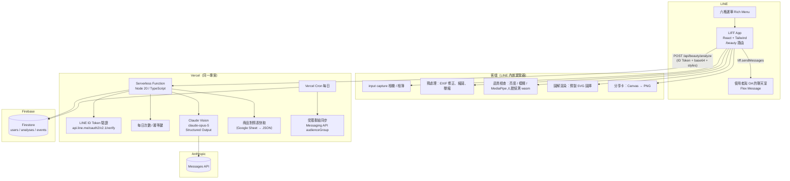

# 02 · 技術架構建議

目標：**最低成本、高穩定度**，並且沿用 Han 已熟悉的技術棧（本 repo 已是 React 19 + Vite + Tailwind 4 + Firebase + Vercel，且 `@line/liff` 已在依賴中）。

---

## 1. 整體架構



### 為什麼是這個組合

| 選擇 | 理由 | 替代方案（不選的原因） |
|---|---|---|
| **React + Vite + Tailwind**（現有） | 零學習成本；`/beauty` 加一條路由與獨立 chunk 即可 | Vue：要重建設計系統與 hooks；Next.js：本專案已用 Vite + prerender，不值得搬 |
| **Vercel Serverless Function** 當後端 | 與前端同專案、同網域（省 CORS）、免費額度足夠（Hobby 100GB-hr/月）、金鑰放環境變數 | Firebase Cloud Functions：需 Blaze 方案、冷啟動較慢、多一套部署；自架 VPS：維運成本 |
| **Firestore** 存標籤與事件 | 現有專案已有 Firestore + 規則；免費額度每日 5 萬讀 / 2 萬寫足夠 | Supabase / Postgres：多一套帳號與 SDK |
| **不用 Firebase Storage 存原圖** | 個資風險最低、省儲存與規則；影像直接 base64 進 function（≤300KB，遠低於 Vercel 4.5MB body 上限） | 存圖再讓 AI 取 URL：多一次往返，且要處理刪除排程 |
| **Claude Vision（Messages API）** | 單一模型同時做臉型 / 色彩 / 膚質 / 文案，且 **Structured Output 可強制 JSON Schema**（前端圖庫匹配的前提） | GPT-4o：同樣可行，但本專案已用 Anthropic SDK 生態；自訓 CV 模型：資料與維運成本不划算 |
| **MediaPipe Face Detection（wasm）** 在客端 | 免費、離線、~30ms；上傳前先擋掉「無臉 / 多臉 / 臉太小」，省 AI 費用與等待 | 全交給 AI 判斷：每次失敗照樣付費 |
| **報告用 `liff.sendMessages` 送回聊天室** | 由使用者端送出，**不計入 OA 推播額度**（台灣 OA 以則計價） | Messaging API push：每則計費 |

## 2. LINE 端設定

| 項目 | 設定 |
|---|---|
| LINE Login channel | 建立 LIFF App：Size `Full`、Endpoint `https://uggboardgame.com/beauty`（或新網域）、Scope `profile openid`、勾 `Bot link feature: On (Aggressive)` 讓未加好友者順便加好友 |
| Messaging API channel | 與 LINE Login 綁在同一 Provider（同一 `userId`）；Channel access token（long-lived）存 Vercel 環境變數，僅供受眾同步與（可選）推播 |
| Rich Menu | 2500×1686、六格版型；其中一格 action = `uri`，值為 `https://liff.line.me/{LIFF_ID}?ref=menu`；用 Messaging API 建立並設為預設 |
| 店內 QR / IG | `https://liff.line.me/{LIFF_ID}?ref=store` / `?ref=ig`（LIFF 會保留 query string） |

LIFF 內相機注意事項：
- **不要用 `getUserMedia`**：iOS LINE 內嵌瀏覽器支援不穩。用 `<input type="file" accept="image/*" capture="user">` 呼叫原生相機，穩定且不需權限對話框設計。
- `liff.sendMessages` 只在「從 LINE 開啟、且是 1 對 1 聊天室」可用；外部瀏覽器要 fallback 成「複製連結」。
- `liff.shareTargetPicker` 可讓使用者把分享卡（Flex）傳給朋友，是免費的裂變管道。

## 3. 前端模組（`src/beauty/`）

```
src/beauty/
├── BeautyApp.jsx           # 路由殼：/beauty, /beauty/report/:id
├── liff/useLiff.js         # init / login / profile / sendMessages / isInClient
├── capture/
│   ├── CaptureGuide.jsx    # 指引卡
│   ├── PhotoInput.jsx      # input capture + 相簿
│   ├── preprocess.js       # EXIF、resize 1024、JPEG 0.82
│   └── quality.js          # 亮度、Laplacian 模糊、MediaPipe 人臉偵測
├── style/StylePicker.jsx   # 風格 chips、情境、膚況自述
├── analysis/useAnalyze.js  # 呼叫 /api/beauty/analyze，重試、逾時、進度狀態
├── report/
│   ├── ReportPage.jsx
│   ├── FaceDiagram.jsx     # SVG 圖層渲染（見 03 文件）
│   ├── ColorSwatches.jsx
│   └── flex.js             # 產生 Flex Message JSON
├── share/ShareCard.jsx     # Canvas 1080×1920 → PNG
├── cta/ProductPicks.jsx    # 依膚質 / 季型挑 3 件
└── assets/diagrams/        # 6 臉型 × 3 圖層 SVG + base face
```

Vite 設定：`/beauty` 走 `React.lazy` 獨立 chunk；MediaPipe wasm 另外 lazy load（約 1–2MB，只在進入拍照頁時載）。

## 4. 後端 API

### 4.1 `POST /api/beauty/analyze`

```jsonc
// Request
{
  "idToken": "<liff.getIDToken()>",
  "image": "<base64 jpeg, ≤300KB>",
  "styles": ["korean_bare", "office"],
  "context": "daily",
  "selfReport": ["oily_tzone"],
  "clientQuality": { "brightness": 128, "blur": 210, "faceBoxRatio": 0.34 },
  "idempotencyKey": "<uuid>"
}
// Response 200
{ "analysisId": "abc123", "result": { /* analysis-schema.json */ }, "products": [ /* 3 件 */ ] }
// Response 422 → result.quality.ok=false（不計次數）
// Response 429 → 今日次數已用完
```

流程：
1. 驗證 ID Token（`POST https://api.line.me/oauth2/v2.1/verify`，帶 `id_token` 與 `client_id`），取得 `sub`（userId）。
2. Firestore transaction：讀 `users/{uid}.dailyCount`（依日期），≥3 則 429；用 `idempotencyKey` 防重送。
3. 呼叫 Claude（下節），逾時 25s，失敗重試 1 次。
4. `quality.ok=false` → 回 422，不扣次數。
5. 寫入 `analyses/{id}`（不含影像）、更新 `users/{uid}.tags`、寫 `events`。
6. 從商品對照表（Google Sheet 匯出的 JSON，function 內快取 1 小時）挑 3 件，回傳。

### 4.2 `POST /api/beauty/event`
CTA 點擊、圖層切換、回饋 👍👎；批次寫入 `events`。

### 4.3 `GET /api/beauty/report/:id`
本人重開報告（ID Token 驗證 `uid == analysis.uid`）。

### 4.5 「我想預約彩妝課」→ 開啟 Han 官方 LINE 對話框並預填文字

不需要後端。用 LINE 官方的 **oaMessage 網址格式**，點擊後 LINE 會切換到指定官方帳號的聊天室，並把文字放進輸入框（使用者可修改後再按送出）：

```
https://line.me/R/oaMessage/{OA_ID}/?{URL-encoded 文字}
```

- `{OA_ID}` 是官方帳號的基本 ID 或專屬 ID，含 `@`，要 URL-encode 成 `%40`（例：`@han-beauty` → `%40han-beauty`）。
- 若 Han 的官方 LINE 與放六格選單的 OA 是**同一個帳號**，也可以改用 `liff.sendMessages()` 直接代使用者送出再 `liff.closeWindow()`；但那樣使用者不能先編輯。既然需求是「自動預設一段文字」，用 oaMessage 較符合，且**即使兩個帳號不同也能用**。
- 未加好友時 LINE 會先跳出加好友畫面，加完自動進聊天室，等於順便導好友。
- 文字建議控制在 200 字內（網址過長在部分 Android 版本會被截斷）。

預填文字模板（由前端依分析結果組出）：

```
我想預約彩妝課 💄
【AI 診斷精簡版】
臉型：鵝蛋臉｜量感：淡顏
個人色彩：夏季型（冷色・柔和）
膚質：混合肌
想要的風格：韓系清透裸妝、職場通勤
報告編號：BL-2026-0915-A3F2
```

前端實作：

```js
const text = buildBookingSummary(result, styles, analysisId);
const url = `https://line.me/R/oaMessage/${encodeURIComponent(OA_ID)}/?${encodeURIComponent(text)}`;
await trackEvent("cta_click", { type: "class_booking", analysisId });
if (liff.isInClient()) liff.openWindow({ url, external: false }); else location.href = url;
```

後端同時在 `users/{uid}.tags` 追加 `intent:class`。Han 在聊天室看到「報告編號」後，可到店員 APP 的報告查詢頁（M8）用編號打開完整報告。

### 4.6 商品對照表：是什麼、怎麼用

**用途**：分析完成後，「為你挑的保養 / 彩妝」區塊要從你的商品裡挑 3 件。挑選依據是 AI 回傳的 `skin.type`（膚質）、`skin.observations`（泛紅、毛孔…）、`personal_color.season`（季型），臉型只影響妝容畫法、不影響選品。對照表就是「哪種膚質 / 季型 → 推哪些商品」的規則表，由 Han 維護。

**格式**：一張 Google Sheet，每列一件商品，後端每小時抓成 JSON 快取。

| 欄位 | 說明 | 範例 |
|---|---|---|
| `sku` | 商品代碼（唯一） | `SERUM-01` |
| `name` | 顯示名稱 | 積雪草舒緩精華 |
| `category` | `skincare` / `makeup` | `skincare` |
| `url` | 官網商品頁（後端自動加 UTM） | `https://shop.example.com/p/serum-01` |
| `image` | 商品圖網址（正方形） | … |
| `price` | 顯示價格 | `880` |
| `skin_types` | 適用膚質，逗號分隔；空白 = 全部 | `oily,combination` |
| `observations` | 命中這些觀察就加分，逗號分隔 | `redness,acne` |
| `seasons` | 適用季型（彩妝用），空白 = 全部 | `summer,winter` |
| `priority` | 同分時的排序（數字小優先） | `1` |
| `active` | `TRUE` / `FALSE` | `TRUE` |

**選品規則**（後端）：先過濾 `active` 與膚質相符，再依 `observations` 命中數與 `seasons` 相符加分，取分數最高的 3 件，保證至少 1 件保養 + 1 件彩妝。若你已有現成的商品清單或別人的對照表，只要能整理成上面的欄位就能直接用；**品項與規則本身建議由 Han 自己的產品線定義**，因為導購連結要導回自家官網。

### 4.4 Vercel Cron `0 18 * * *`（台灣 02:00）
把前一日新增 / 變更標籤的使用者同步進 LINE 受眾群組（`POST /v2/bot/audienceGroup/upload` 建群，`PUT /v2/bot/audienceGroup/upload` 追加 userId），每個季型與膚質各一群，供 OA 後台「分眾推播」直接選用。

## 5. AI 呼叫設計

### 5.1 模型與參數

| 項目 | 建議 |
|---|---|
| 模型 | `claude-opus-5`（預設）。如要更低成本可改 `claude-sonnet-5`，同一份程式只需換 model id；先以 opus 建立品質基準再決定 |
| 輸出 | **Structured Output**（`output_config.format` + `analysis-schema.json`），保證前端一定拿到合法代碼，不用正則刮 JSON |
| Thinking | 省略 `thinking` 參數（Opus 5 預設 adaptive）；`output_config.effort: "medium"`（分類任務不需要 high） |
| 系統提示 | 放判斷準則（臉型量測定義、四季型三軸判斷法、膚質觀察項、語氣規範、圖庫代碼定義），約 2–3k tokens，加 `cache_control` 快取 |
| 影像 | 1024px 長邊 JPEG，約 1,400 input tokens |
| 拒絕處理 | 檢查 `stop_reason === "refusal"`；並開啟 `fallbacks: "default"`（beta header `server-side-fallback-2026-07-01`），被分類器拒絕時由伺服端改用其他模型重跑 |
| 版本 | 每次記錄 `promptVersion`、`model`、`usage`，方便日後 A/B 與成本追蹤 |

### 5.2 程式碼骨架（`api/beauty/analyze.ts`）

```typescript
import Anthropic from "@anthropic-ai/sdk";
import schema from "../../docs/beauty-ai-liff/analysis-schema.json";

const client = new Anthropic(); // ANTHROPIC_API_KEY 由 Vercel 環境變數提供

const SYSTEM_PROMPT = `你是專業的韓系彩妝師與個人色彩顧問……（判斷準則、代碼定義、語氣規範）`; // 固定內容，可快取

export async function analyzeFace(imageBase64: string, styles: string[], selfReport: string[]) {
  const response = await client.beta.messages.create({
    model: "claude-opus-5",
    max_tokens: 4000,
    betas: ["server-side-fallback-2026-07-01"],
    fallbacks: "default",
    output_config: {
      effort: "medium",
      format: { type: "json_schema", schema },
    },
    system: [{ type: "text", text: SYSTEM_PROMPT, cache_control: { type: "ephemeral" } }],
    messages: [
      {
        role: "user",
        content: [
          { type: "image", source: { type: "base64", media_type: "image/jpeg", data: imageBase64 } },
          {
            type: "text",
            text: `使用者勾選的風格：${styles.join("、") || "未選"}；膚況自述：${selfReport.join("、") || "無"}。請依系統準則分析並輸出 JSON。`,
          },
        ],
      },
    ],
  });

  if (response.stop_reason === "refusal") {
    throw new Error(`refused:${response.stop_details?.category ?? "unknown"}`);
  }
  const text = response.content.find((b) => b.type === "text");
  if (!text || text.type !== "text") throw new Error("no_text_block");
  return { result: JSON.parse(text.text), usage: response.usage, model: response.model };
}
```

> 實作時以 `@anthropic-ai/sdk` 的 `messages.parse` + `zodOutputFormat` 亦可（把 JSON Schema 改寫成 Zod），型別更完整；兩者擇一。

### 5.3 系統提示的重點段落（摘要）

1. **角色與界線**：彩妝師語氣、只描述可觀察特徵、不做醫療判斷、不評價美醜、不提年齡體重。
2. **臉型判斷法**：臉長寬比、額 / 顴 / 下顎三寬度關係、下顎線角度、下巴形狀 → 對應六型；要求給 1–2 句依據。
3. **量感**：眼鼻唇占臉面積比例、線條粗細、對比度 → 淡 / 中 / 濃；比例特性用給定枚舉。
4. **個人色彩**：先判溫度（膚底黃 / 粉、血管、髮瞳色），再明度、再彩度；照片光線偏色時降低信心度；信心度 < 0.6 前端會用「傾向」措辭。
5. **膚質**：僅依可見特徵（T 區光澤、毛孔、泛紅、乾紋）初判；提醒為照片初判。
6. **妝容代碼對照表**：每個臉型允許的 `blush.placement` / `contour.zones` / `highlight.zones` 集合，確保 AI 只從圖庫有的代碼裡選（Schema 已用 enum 限制，提示再補「為什麼」的邏輯）。
7. **輸出品質檢查**：`quality.issues` 的判定門檻（側臉 > 20°、遮擋、多臉、濃妝影響色彩判斷）。

## 6. 資料模型（Firestore）

```
users/{lineUserId}
  displayName, pictureUrl, firstSeenAt, lastSeenAt, ref
  tags: ["face:oval","season:summer","volume:light","skin:combination","style:korean_bare","stage:analyzed","intent:product"]
  daily: { "2026-09-15": 2 }
  consentAt, deletedAt?

analyses/{analysisId}
  uid, createdAt, promptVersion, model, usage:{input,output,cacheRead}
  input: { styles[], context, selfReport[], clientQuality{} }   // 無影像
  result: { ...analysis-schema.json }
  products: [{sku,name,url}]
  feedback?: "up"|"down"

events/{autoId}
  uid, analysisId?, type, payload{}, ref, ts
  // type: entry, liff_ready, consent_ok, photo_selected, quality_fail, style_selected,
  //       analysis_start, analysis_done, report_view, layer_toggle, cta_click, share_card, send_to_chat, feedback

config/products          // 由 Google Sheet 同步的商品對照表（skinType × season → sku[]）
config/limits            // dailyPerUser, dailyGlobal, promptVersion
```

Firestore 規則：客端**不直接讀寫**這些集合（全部走 function 用 Admin SDK），規則對這些路徑一律 `allow read, write: if false`，最單純也最安全。

## 7. 成本試算（每次分析）

假設：系統提示 2,500 tokens（快取命中）、影像 1,400 tokens、使用者文字 100 tokens、輸出 1,200 tokens。

| 項目 | claude-opus-5（$5 / $25 per MTok） | claude-sonnet-5（$2 / $10 per MTok） |
|---|---|---|
| 系統提示（快取讀取 ≈ 0.1×） | 2,500 × $0.5/M = $0.00125 | $0.0005 |
| 影像 + 文字輸入 | 1,500 × $5/M = $0.0075 | $0.003 |
| 輸出 | 1,200 × $25/M = $0.03 | $0.012 |
| **AI 小計** | **≈ $0.039（NT$1.25）** | **≈ $0.016（NT$0.5）** |
| Vercel / Firebase | 免費額度內（每月 < 5,000 次） | 同左 |
| LINE 訊息 | 0（報告由使用者端送出） | 0 |

每月 2,000 次分析：Opus 約 NT$2,500、Sonnet 約 NT$1,000。建議先用 Opus 建立「判斷品質基準」（用 30 張店內同意的測試照 + Han 的專業判斷做對照表），若 Sonnet 在基準上達到相同準確度再切換。

## 8. 穩定性與降級

| 情境 | 處理 |
|---|---|
| AI 逾時（> 25s） | 前端顯示「再等一下」並自動重試 1 次；仍失敗保留照片與風格，按鈕重送 |
| AI 429 / 5xx | SDK 內建重試 2 次（`max_retries`），再失敗回 503 與友善文案 |
| `refusal` | `fallbacks: "default"` 由伺服端改模型重跑；仍拒絕則回 422「這張照片無法分析，請換一張」 |
| Schema 驗證失敗 | Structured Output 理論上不會發生；仍做 Ajv 驗證，失敗記錄並重試 |
| Firestore 不可用 | 分析仍回傳給使用者，事件寫入改為 best-effort |
| 全站每日上限 | `config/limits.dailyGlobal`，超過顯示「今日名額已滿」 |

## 9. 資安與個資

- **ID Token 驗證**在每個 API 上；不信任客端傳來的 userId。
- **原圖不落地**：function 記憶體處理完即丟；Vercel logs 不印 base64。
- **AI 供應商資料處理**：在隱私政策註明影像會傳送至境外 AI 服務處理且不用於訓練；Anthropic API 預設不以客戶資料訓練。
- **刪除權**：`DELETE /api/beauty/me` 清空 `users/{uid}` 與其 `analyses`。
- **金鑰**：`ANTHROPIC_API_KEY`、`LINE_CHANNEL_ACCESS_TOKEN`、`LINE_LOGIN_CHANNEL_ID`、Firebase service account 全在 Vercel 環境變數；前端只暴露 `VITE_LIFF_ID`。
- **速率**：每人每日 3 次 + 全站上限 + 影像大小上限 400KB + 只接受 `image/jpeg`。

## 10. 可觀測性

- 每次分析寫 `usage`（input / output / cache_read tokens）與 `durationMs`，Firestore 每週彙總一次成本。
- 前端事件走 `/api/beauty/event`（批次），加上既有的 Vercel Analytics。
- 錯誤：Vercel Function logs；可加 Sentry（免費層）於 Phase 2。
