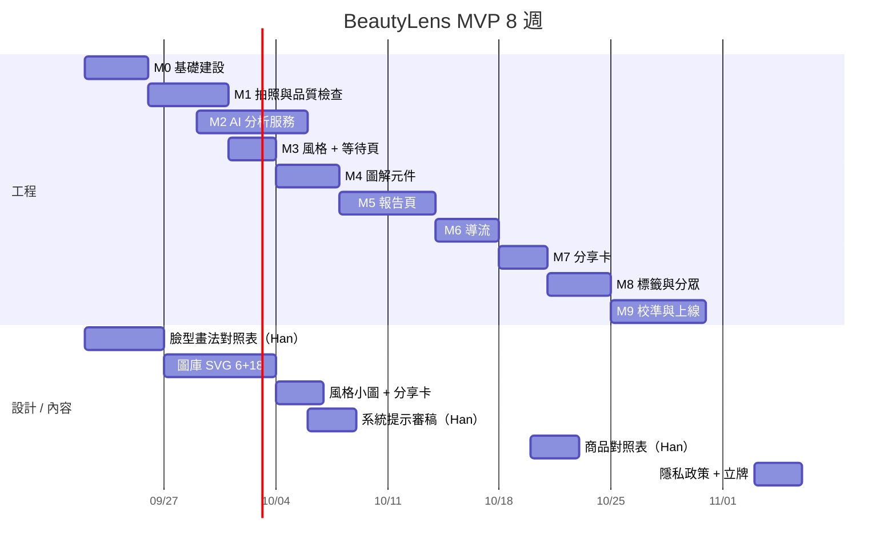

# 04 · 開發時程與工程模組拆解

前提：1 位全端工程師（熟 React / Node）+ 1 位設計師（兼職，約 40%）+ Han 提供專業內容（臉型畫法對照表、色彩型色票、商品對照表、系統提示審稿）。以 **8 週** 上線 MVP，第 9–12 週為 Phase 2。

---

## 1. 模組拆解

| 模組 | 內容 | 產出 | 工時（人日） | 依賴 |
|---|---|---|---|---|
| **M0 基礎建設** | LINE Login / Messaging API channel、LIFF App、Rich Menu 六格、Vercel 環境變數、Firestore 集合與規則、`/beauty` 路由 + 獨立 chunk、`api/beauty/*` 骨架、ID Token 驗證 | 可從六格選單開啟的空白 LIFF、Hello API | 3 | — |
| **M1 拍照與品質檢查** | 指引卡、`input capture`、EXIF / 縮圖 / 壓縮、亮度與模糊檢查、MediaPipe 人臉偵測 lazy load、預覽與重拍 | 可拍出合格照片並得到 base64 | 4 | M0 |
| **M2 AI 分析服務** | 系統提示 v1、Structured Output（schema）、Claude 呼叫、逾時 / 重試 / refusal 處理、每日次數與冪等、`analyses` 寫入、usage 記錄 | `POST /api/beauty/analyze` 回傳合法 JSON | 5 | M0、Han 的判斷準則 |
| **M3 風格選填 + 等待頁** | 風格 chips（含小圖）、情境、膚況自述、分析並行、進度動畫 | 風格頁 → 等待頁 → 拿到結果 | 2 | M1、M2 |
| **M4 圖解圖庫** | 6 底圖 + 18 圖層 SVG（設計）、`FaceDiagram` 元件、圖層開關、顏色變數、對照表文字 | 任一臉型 + zones 皆可正確渲染 | 設計 5 / 工程 3 | Han 的對照表 |
| **M5 報告頁** | 7 個區塊、色票元件、膚質與保養重點、👍👎 回饋、報告重開路由、Flex Message 產生與 `liff.sendMessages` | 完整報告 + 傳到聊天室 | 5 | M2、M4 |
| **M6 導流** | 商品對照表（Google Sheet → JSON 快取）、依膚質 / 色調挑 4 件（2 保養 + 2 彩妝）、UTM、預約按鈕（預填參數）、事件 API | 三個 CTA 可用且有事件 | 3 | M5 |
| **M7 分享卡** | Canvas 1080×1920 版型、含 QR 與 `?ref=ig`、儲存圖片與傳到聊天室、`shareTargetPicker` | 可存 PNG 的分享卡 | 設計 1 / 工程 2 | M5 |
| **M8 標籤與分眾** | `users.tags` 寫入、`intent:*` 追加、Vercel Cron 受眾群組同步、簡易後台查詢（可放進既有店員 APP） | OA 後台可選受眾群組推播 | 3 | M2、M6 |
| **M9 品質校準與上線** | 30 張測試照校準（Han 標註 vs AI）、提示詞迭代 2–3 輪、iOS / Android LINE 實機測試、隱私政策、店內立牌、上線 | 準確度報告、上線 checklist | 5 | 全部 |

工程合計約 **35 人日**，設計約 **7 人日**。

## 2. 八週排程

| 週 | 里程碑 | 驗收標準 |
|---|---|---|
| W1 | M0 完成、Han 交付臉型畫法對照表 | 六格選單可開 LIFF 並顯示 LINE 名字；API 能驗證 ID Token |
| W2 | M1、M2 第一版 | 手機上可拍照、擋掉太暗 / 無臉；後端回傳合法 JSON，10 張測試照無錯誤 |
| W3 | M3、M4 | 完整前半流程；6 臉型圖解皆可渲染、可切換圖層 |
| W4 | M5 | 報告頁完整；可傳 Flex 到聊天室 |
| W5 | M6、M7 | 三個 CTA 有效、事件入庫；分享卡可存圖 |
| W6 | M8 | 標籤寫入；Cron 同步受眾群組；OA 後台可見群組人數 |
| W7 | M9 校準 | 30 張測試照臉型一致率 ≥ 80%、冷暖色調一致率 ≥ 80%（與 Han 判斷比） |
| W8 | 上線 | iOS / Android LINE 實機通過；隱私政策上線；店內立牌到位；成本監控可看 |

## 3. Phase 2（W9–W12，視 MVP 數據決定）

| 項目 | 觸發條件 | 工時 |
|---|---|---|
| 方案 C：圖解疊在客人照片上（MediaPipe Face Landmarker） | 報告 👍 率 ≥ 70% 但分享率 < 15%（需要更「像我」的圖） | 10–15 人日 |
| 48 小時未行動追蹤推播 | CTA CTR < 20% | 2 人日 |
| 店員代客操作模式（店內平板） | 店內完成率低 | 3 人日 |
| 歷史紀錄比較（需存圖同意） | 回訪率 > 20% | 5 人日 |
| 模型成本優化：以校準集比較 `claude-sonnet-5` | 月分析量 > 3,000 | 2 人日 |
| 眉型 / 髮型建議 | 使用者回饋要求 | 5 人日 + 圖庫 |

## 4. 上線前檢查清單

- [ ] LIFF Endpoint 為 HTTPS 正式網域，LINE Login channel 已「公開」
- [ ] Rich Menu 六格已設為預設選單，`?ref=menu` 正常
- [ ] `ANTHROPIC_API_KEY`、`LINE_CHANNEL_ACCESS_TOKEN`、`LINE_LOGIN_CHANNEL_ID`、Firebase 憑證僅在 Vercel 環境變數
- [ ] 每人每日 3 次、全站每日上限、影像大小上限生效
- [ ] 原圖不落地：檢查 logs 無 base64、Storage 無新增檔案
- [ ] iOS LINE 與 Android LINE 最近兩版：拍照、相簿、`sendMessages`、儲存分享卡皆通過
- [ ] 外部瀏覽器開啟顯示「請從 LINE 開啟」
- [ ] 隱私政策連結、同意文案、刪除資料功能可用
- [ ] 30 張校準集通過門檻，`promptVersion` 已標記
- [ ] 成本儀表：每日 token 用量與分析次數可查
- [ ] 店內立牌 QR（`?ref=store`）、IG 連結（`?ref=ig`）已產出

## 5. 人力與角色

| 角色 | 職責 | 投入 |
|---|---|---|
| Han（產品 / 專業內容） | 對照表、色票、商品表、系統提示審稿、校準標註、文案語氣 | 每週 4–6 小時 |
| 全端工程師 | M0–M9 | 全職 8 週 |
| 設計師 | 圖庫 SVG、風格小圖、分享卡、報告視覺 | 兼職 W1–W4 |
| 店員 | W7 實機測試、W8 後店內引導 | 少量 |
